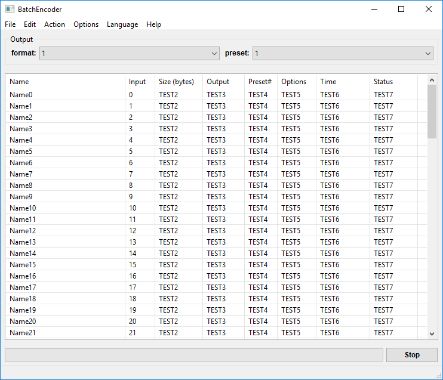
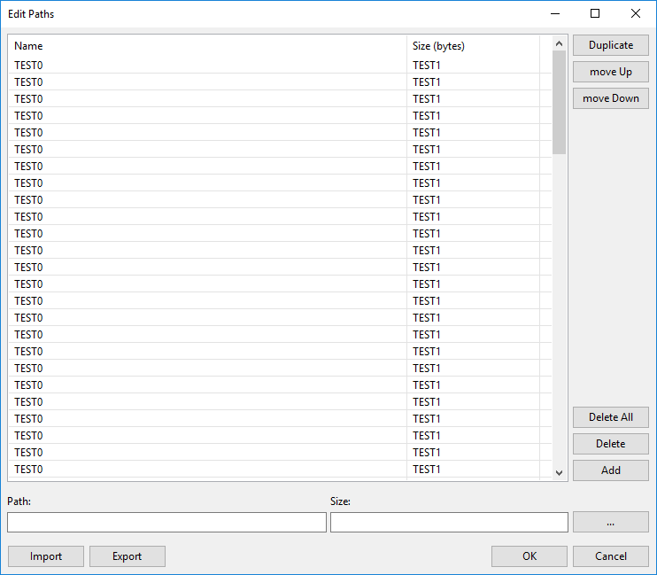

# BatchEncoder wxWidgets Demo

[](https://ci.appveyor.com/project/wieslawsoltes/batchencoderwx/branch/master)

## Screenshots

### File list

[](https://github.com/wieslawsoltes/BatchEncoderWx/blob/master/screenshots/FileList.png)

### Conversion progress

[](https://github.com/wieslawsoltes/BatchEncoderWx/blob/master/screenshots/FileListConverting.png)

### Configure presets

[](https://github.com/wieslawsoltes/BatchEncoderWx/blob/master/screenshots/ConfigurePresets.png)

### Configure formats

[](https://github.com/wieslawsoltes/BatchEncoderWx/blob/master/screenshots/ConfigureFormats.png)

### Configure tools

[](https://github.com/wieslawsoltes/BatchEncoderWx/blob/master/screenshots/ConfigureTools.png)

### Edit paths

[](https://github.com/wieslawsoltes/BatchEncoderWx/blob/master/screenshots/EditPaths.png)

## UI 

Download and install wxFormBuilder:
```
https://github.com/wxFormBuilder/wxFormBuilder/releases/download/v3.6.2/wxFormBuilder_v3.6.2.exe
```

Open and edit `src\ui\UI.fbp` project and then got to `File > Generate Code` and `Tools > Generated Inherited Class`.

## Build

### Sources

Clone the `BatchEncoder` source code repository.
```
git clone https://github.com/wieslawsoltes/BatchEncoderWx.git
```

Update `wxWidgets` submodule.
```
git submodule update --init --recursive
```

### RuntimeLibrary

Patch `RuntimeLibrary`:
```
.\build.ps1 -Target "Patch-RuntimeLibrary"
```

Restore `RuntimeLibrary`:
```
.\build.ps1 -Target "Restore-RuntimeLibrary"
```

### wxWidgets

Currently used `wxWidgets` version is `3.1.1`.

Open `wx\build\msw\wx_vc15.sln` solution.

Build the following projects:
```
core
net
xml
adv
html
gl
qa
xrc
aui
propgrid
ribbon
richtext
media
stc
webview
```
using the following configurations:
```
Debug|Win32
Debug|x64
Release|Win32
Release|x64
```

You can use `Build > Batch Build...` tool to batch build all projects and configurations.

### BatchEncoder

Use `Visual Studio 2017 Community Edition` to open `BatchEncoder.sln` solution and `Build`.

## Links

* https://github.com/wxWidgets/wxWidgets
* https://github.com/wxWidgets/wxWidgets/blob/master/docs/msw/install.txt
* https://www.wxwidgets.org/
* https://www.wxwidgets.org/docs/tutorials/


### Docs

* http://docs.wxwidgets.org/
* http://docs.wxwidgets.org/3.1.1/overview_helloworld.html
* http://docs.wxwidgets.org/3.1.1/page_libs.html
* http://docs.wxwidgets.org/3.1.1/overview_cmndlg.html

### Wiki

* https://wiki.wxwidgets.org/Main_Page
* https://wiki.wxwidgets.org/Guides_%26_Tutorials
* https://wiki.wxwidgets.org/WxWidgets_For_MFC_Programmers
* https://wiki.wxwidgets.org/Microsoft_Visual_C%2B%2B_Guide
* https://wiki.wxwidgets.org/Reducing_Executable_Size
* https://wiki.wxwidgets.org/Precompiled_Headers
* https://wiki.wxwidgets.org/WxListCtrl
* https://wiki.wxwidgets.org/Beech:Using_common_dialogs

### Forums

* https://forums.wxwidgets.org/index.php

### Tools

* https://github.com/wxFormBuilder/wxFormBuilder

### Books

* https://www.wxwidgets.org/docs/book/
* https://books.google.pl/books?id=CyMsvtgnq0QC&lpg=PA188&dq=wxWidgets%20xml%20layout&hl=pl&pg=PP1#v=onepage&q&f=false

### Articles

* https://www.codeproject.com/Articles/11515/Introduction-to-wxWidgets
* https://usingcpp.wordpress.com/2016/01/26/creating-wxwidgets-programs-with-visual-studio-2015/
* http://www.zytrax.com/tech/survival/wxwidgets.html
